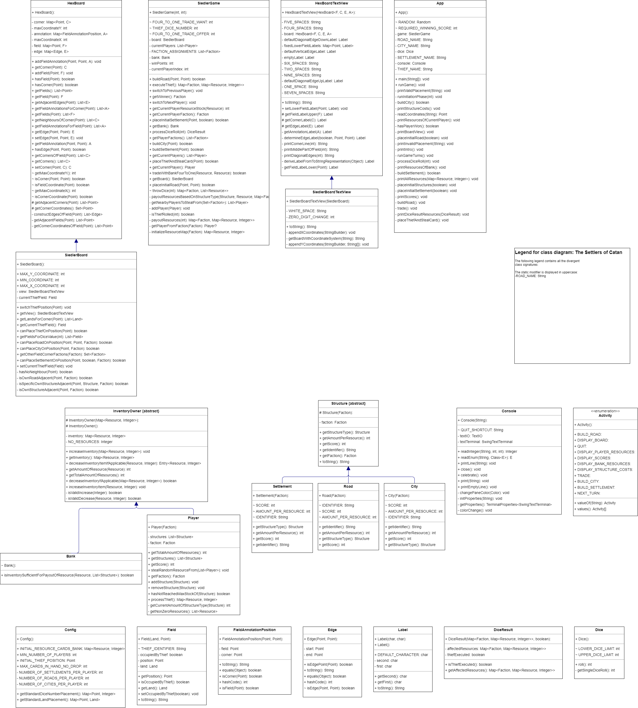
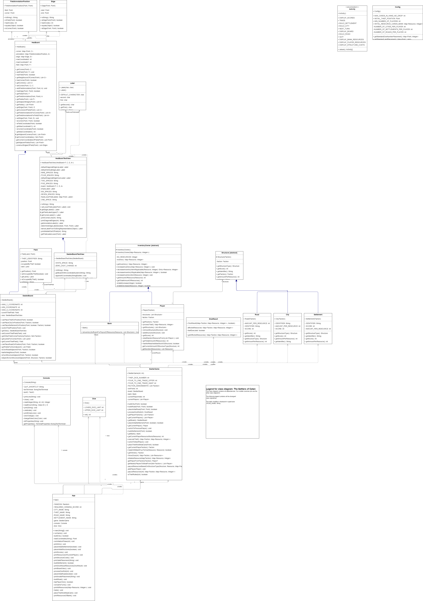

# Catan

Catan is a board game that simulates the building and development of a settlement on a fictional island.

## Getting started

### Clone the repository

1. Open the repository in the IntelliJ IDE and navigate to the `App.java` file.
2. Click  `Run` next to the `Current File` option on the toolbar.
3. The program is compiled and started accordingly. After that the [commands](#available-commands) listed below can be
   used in the console.

## Available commands

| Command                  | Description                                                                       |
| :----------------------- | :-------------------------------------------------------------------------------- |
| DISPLAY_BOARD            | Print the current state of the game board to the console.                         |
| DISPLAY_PLAYER_RESOURCES | Shows the current resource amounts for a given player.                            |
| DISPLAY_BANK_RESOURCES   | Displays the current number of each resource type in the game bank.               |
| DISPLAY_STRUCTURE_COSTS  | Shows the cost of building each type of structure in the game.                    |
| DISPLAY_SCORES           | Displays the current scores of all players in the game.                           |
| TRADE                    | Allows players to exchange resources with the bank.                               |
| BUILD_ROAD               | Allows a player to build a road at a specified location on the game board.        |
| BUILD_SETTLEMENT         | Allows a player to build a settlement on an empty intersection on the game board. |
| BUILD_CITY               | Allows a player to build a city on an existing settlement on the game board.      |
| NEXT_TURN                | Advances the game to the next player's turn.                                      |
| QUIT                     | Allows the user to exit the game.                                                 |

## Features

- Basic functionality
- Hexboard with coordinate system
- Winning animation
- Cities extension
- Robber extension

## Classdiagram

### Without dependencies

### With dependencies

